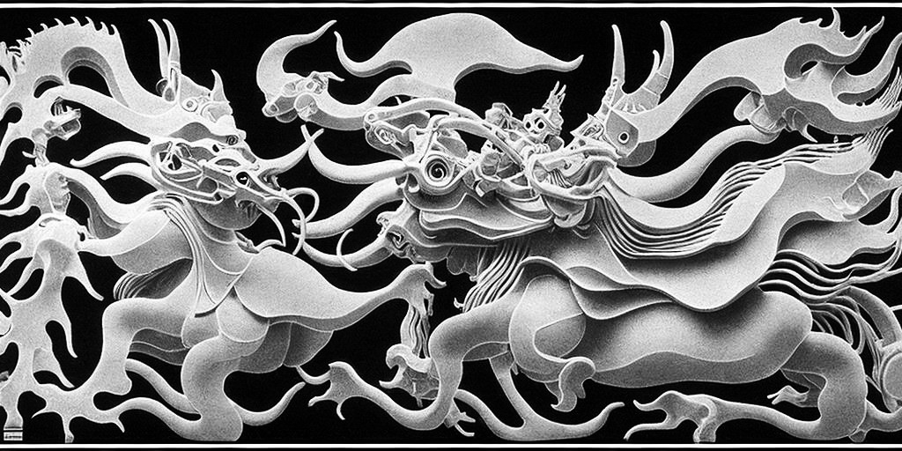

# Stable Diffusers for studies

<p align='center'></p>

[](https://colab.research.google.com/github/eps696/SDfu/blob/master/SDfu_colab.ipynb)

This is yet another Stable Diffusion compilation, aimed to be functional, clean & compact enough for various experiments. There's no GUI here, as the target audience are creative coders rather than post-Photoshop users. The latter may check [InvokeAI] or [AUTOMATIC1111](https://github.com/AUTOMATIC1111/stable-diffusion-webui) as a convenient production tool, or [Deforum] for precisely controlled animations.  

The code is based on the [diffusers] library, with occasional additions from the others mentioned below. The following codebases are partially included here (to ensure compatibility and the ease of setup): [k-diffusion](https://github.com/crowsonkb/k-diffusion), [CLIPseg], [LPIPS](https://github.com/richzhang/PerceptualSimilarity).  
There is also a [similar repo](https://github.com/eps696/SD) (kinda obsolete now), based on the [CompVis] and [Stability AI] libraries.  

Current functions:
* Text to image
* Image re- and in-painting
* Various interpolations (between/upon images or text prompts, smoothed by [latent blending])
* Guidance with [ControlNet] (pose, depth, canny edges) and [Instruct pix2pix]
* Text to video with [ZeroScope] and [Potat] models

Fine-tuning with your images:
* Add subject (new token) with [textual inversion]
* Add subject (new token + Unet delta) with [custom diffusion]
* Add subject (new token + Unet delta) with [LoRA]

Other features:
* Memory efficient with `xformers` (hi res on 6gb VRAM GPU)
* Multi guidance technique for better interpolations
* Use of special models: inpainting, SD v2, [Kandinsky]
* Masking with text via [CLIPseg]
* Weighted multi-prompts (with brackets or numerical weights)
* to be continued..  

## Setup

Install CUDA 11.8 if you're in Windows (seems not necessary on Linux with Conda).  
Setup the Conda environment:
```
conda create -n SD python=3.10 numpy pillow 
activate SD
pip install torch torchvision torchaudio --extra-index-url https://download.pytorch.org/whl/cu118
pip install -r requirements.txt
pip install xformers
```
NB: It's preferrable to install `xformers` library - to increase performance and to run SD in any resolution on the lower grade hardware (e.g. videocards with 6gb VRAM). However, it's not guaranteed to work with all the (quickly changing) versions of `pytorch`, hence it's separated from the rest of requirements. If you're on Windows, first ensure that you have Visual Studio 2019 installed. 

Run command below to download Stable Diffusion [1.5](https://huggingface.co/CompVis/stable-diffusion), [1.5 Dreamlike Photoreal](https://huggingface.co/dreamlike-art/dreamlike-photoreal-2.0), [2-inpaint](https://huggingface.co/stabilityai/stable-diffusion-2-inpainting), 
[2.1](https://huggingface.co/stabilityai/stable-diffusion-2-1-base), [2.1-v](https://huggingface.co/stabilityai/stable-diffusion-2-1), [ZeroScope], [Potat], [custom VAE](https://huggingface.co/stabilityai/sd-vae-ft-ema), [ControlNet], [instruct-pix2pix](https://huggingface.co/timbrooks/instruct-pix2pix), [CLIPseg] models (converted to `float16` for faster loading). Licensing info is available on their webpages.
```
python download.py
```

## Operations

Examples of usage:

* Generate an image from the text prompt:
```
python src/gen.py --in_txt "hello world" --size 1024-576
```
* Redraw directory of images:
```
python src/gen.py --in_img _in/pix -t "neon light glow" --strength 0.7
```
* Inpaint directory of images with RunwayML model, turning humans into robots:
```
python src/gen.py -im _in/pix --mask "human, person" -t "steampunk robot" --model 2i
```
* Make a video (frame sequence), interpolating between the lines of the text file:
```
python src/latwalk.py -t yourfile.txt --size 1024-576
```
* Same, with drawing over a masked image:
```
python src/latwalk.py -t yourfile.txt -im _in/pix/alex-iby-G_Pk4D9rMLs.jpg --mask "human boy" --invert_mask -m 2i
```
* Same as above, with recursive pan/zoom motion (beware of possible imagery degradation on longer runs):
```
python src/recur.py -t yourfile.txt --fstep 5 --scale 0.01 -m 15drm
```
* Hallucinate a video, including your real images:
```
python src/latwalk.py -im _in/pix --cfg_scale 0 -f 1
```
Interpolations can be made smoother (and faster) by adding `--latblend X` option ([latent blending] technique, X in range 0~1). 
If needed, smooth the result further with [FILM](https://github.com/google-research/frame-interpolation).  
Models can be selected with `--model` option by either a shortcut (15, 15drm, 21, 21v), a path on the [Hugging Face] website (e.g. `SG161222/Realistic_Vision_V2.0`; 5gb will be auto-downloaded for further use) or a local path to the already downloaded file set.  
Check other options and their shortcuts by running these scripts with `--help` option.  

There are also Windows bat-files, slightly simplifying and automating the commands. 


## Guide synthesis with [ControlNet] or [Instruct pix2pix]

* Generate an image from existing one, using its depth map as conditioning (extra guiding source):
```
python src/preproc.py -i _in/something.jpg --type depth -o _in/depth
python src/gen.py --control_mod depth --control_img _in/depth/something.jpg -im _in/something.jpg -t "neon glow steampunk" -f 1
```
One can replace `depth` in the commands above with `canny` (edges) or `pose` (if there are humans in the source).  
Option `-im ...` may be omitted to employ "pure" txt2img method, pushing the result further to the text prompt:
```
python src/preproc.py -i _in/something.jpg --type canny -o _in/canny
python src/gen.py --control_mod canny --control_img _in/canny/something.jpg -t "neon glow steampunk" --size 1024-512 --model 15drm
```
ControlNet options can be used for interpolations as well (fancy making videomapping over a building photo?):
```
python src/latwalk.py --control_mod canny --control_img _in/canny/something.jpg --control_scale 0.5 -t yourfile.txt --size 1024-512 --fstep 5
```
or with pan/zoom recursion:
```
python src/recur.py -cmod canny -cimg _in/canny/something.jpg -cts 0.5 -t yourfile.txt --size 1024-640 -fs 5 -is 12 --scale 0.02 -m 15drm
```

One more way of editing images is [Instruct pix2pix]:
```
python src/gen.py -im _in/pix --img_scale 2 -t "turn human to puppet" --model 1p2p
```


## Fine-tuning

* Train new token embedding for a specific subject (e.g. cat) with [textual inversion]:
```
python src/train.py --token mycat1 --term cat --data data/mycat1 -lr 0.001 --type text
```
* Finetune the model (namely, part of the Unet attention layers) with [LoRA]:
```
python src/train.py --token mycat1 --term cat --data data/mycat1 -lr 0.0001 --type lora
```
* Do the same with [custom diffusion]:
```
python src/train.py --token mycat1 --term cat --data data/mycat1 --term_data data/cat --type custom
```
Add `--style` if you're training for a style rather than an object. Speed up [custom diffusion] with `--xformers` ([LoRA] takes care of it on its own); add `--low_mem` if you get OOM.   
Results of the trainings will be saved under `train` directory. 

Custom diffusion trains faster and can achieve impressive reproduction quality (including faces) with simple similar prompts, but it can lose the point on generation if the prompt is too complex or aside from the original category. To train it, you'll need both target reference images (`data/mycat1`) and more random images of similar subjects (`data/cat`). Apparently, you can generate the latter with SD itself.  
LoRA finetuning seems less precise, while may interfere with wider spectrum of topics.  
Textual inversion is more generic but stable. Also, its embeddings can be easily combined together on load.  

* Generate image with trained embedding and weights from [LoRA]:
```
python src/gen.py -t "cosmic <mycat1> beast" --load_lora mycat1-lora.pt
```
* Same with [custom diffusion]:
```
python src/gen.py -t "cosmic <mycat1> beast" --load_custom mycat1-custom.pt
```
* Same with [textual inversion] (you may provide a folder path to load few files at once):
```
python src/gen.py -t "cosmic <mycat1> beast" --load_token mycat1-text.pt
```

You can also run `python src/latwalk.py ...` with finetuned weights to make animations.

Besides special tokens (e.g. `<mycat1>`) as above, text prompts may include brackets for weighting (like `(good) [bad] ((even better)) [[even worse]]`).  
More radical blending can be achieved with multiguidance technique (interpolating predicted noise within diffusion denoising loop, instead of conditioning vectors). It can be used to draw images from complex prompts like `good prompt ~1 | also good prompt ~1 | bad prompt ~-0.5` with `--cguide` option, or for animations with `--lguide` option (further enhancing smoothness of [latent blending]). Note that it would slow down generation process.  

## Special model: Kandinsky 2.2

Another interesting model is [Kandinsky] 2.2, featuring txt2img, img2img, inpaint and depth-based controlnet methods. Its architecture and pipelines differ from Stable Diffusion, so there's separate script for it. The options are similar to the above (no fine-tuning yet); run `python src/kand.py -h` to see unused ones.  
NB: The models (heavy!) auto-downloaded on the first use; otherwise download yourself and set their common path with `--models_dir ...` option.  
As an example, interpolate with ControlNet:
```
python src/kand.py -cimg _in/something.jpg -t yourfile.txt --size 1024-512 -fs 5 -cts 0.6
```

## Special model: Text to Video

Generate short HD video from a text prompt with [ZeroScope] model:
```
python src/vid.py -t "dragon in a China shop" --model vzs
```
Process existing video in duo (first lo-res [ZeroScope], then hi-res [Potat]):
```
python src/vid.py -t "combat in the dancehall" --in_vid yourvideo.mp4 --model vzs --model_up vpot
```
Longer input video would be cut in short pieces and processed one by one. It may be better to process only in hi-res (omitting `--model ...` option).  
NB: the models are limited to rather mundane stuff, don't expect any notable level of abstraction or fantasy here.


## Credits

It's quite hard to mention all those who made the current revolution in visual creativity possible. Check the inline links above for some of the sources. 
Huge respect to the people behind [Stable Diffusion], [Hugging Face], and the whole open-source movement.

[Stable Diffusion]: <https://github.com/CompVis/stable-diffusion>
[diffusers]: <https://github.com/huggingface/diffusers>
[Hugging Face]: <https://huggingface.co>
[CompVis]: <https://github.com/CompVis/stable-diffusion>
[Stability AI]: <https://github.com/Stability-AI/stablediffusion>
[InvokeAI]: <https://github.com/invoke-ai/InvokeAI>
[Deforum]: <https://github.com/deforum-art/deforum-stable-diffusion>
[CLIPseg]: <https://github.com/timojl/clipseg>
[ControlNet]: <https://github.com/lllyasviel/ControlNet>
[Instruct pix2pix]: <https://github.com/timothybrooks/instruct-pix2pix>
[textual inversion]: <https://textual-inversion.github.io>
[custom diffusion]: <https://github.com/adobe-research/custom-diffusion>
[LoRA]: <https://github.com/cloneofsimo/lora>
[latent blending]: <https://github.com/lunarring/latentblending>
[Kandinsky]: <https://huggingface.co/kandinsky-community>
[ZeroScope]: <https://huggingface.co/cerspense/zeroscope_v2_576w>
[Potat]: <https://huggingface.co/camenduru/potat1>
